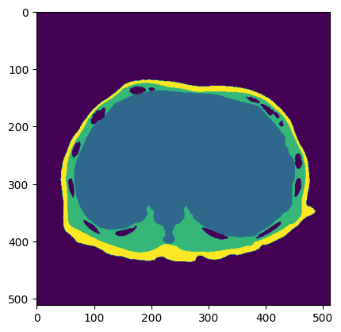

# MOAI 2022 Body Morphometry AI Segmentation Online Challenge
- **Organiser**: Morphometry Open AI Innovation / [Kaggle](https://www.kaggle.com/competitions/body-morphometry-chest)
- **Period**: 20th - 28th Nov, 2022


## Abstract
This model was designed for body morphometry analysis, with a focus on segmenting the chest into three distict parts. The architecture of the model was based on Unet with EfficientNet-B5 as the backbone provided by [Sementation models](https://github.com/qubvel/segmentation_models). In the competition, the model achieved a Mean DSC(Dice Similarity Coefficient) score of 0.94755, the evaluation metric.


## Datasets
The CT image data is in DICOM format, while the label images are in PNG format. The label images are divided into three parts of the chest (Inner, Middle, Outer).


|File|DICOM|Label|
|:---:|:---:|:---:|
|**case001**|||
|**case003**|||

## Installation
You will need to libraries on `requirements.txt`.

```
pip install -r requirements.txt
```


## Results

### Case004
|DICOM|Predicted (Inner)|Predicted (Middle)|Predicted (Outer)|
|:---:|:---:|:---:|:---:|
|||||

|Label (Ground-truth)|Predicted (All)|
|:---:|:---:|
|||


### Case017
|DICOM|Predicted (Inner)|Predicted (Middle)|Predicted (Outer)|
|:---:|:---:|:---:|:---:|
|||||

|Label (Ground-truth)|Predicted (All)|
|:---:|:---:|
|||


Note:
- More information about the EDA and results can be found [here](Body_Morphometry_Chest.ipynb).

## Summary
Unlike regular image format(PNG, JPEG), medical image data(DICOM) requires different image processing for EDA and training. So if you want to have experience managing medical data, this would be a good exercise. It is recommended to use CNN models instead of transformer models since most medical problems have a small amount of data. To improve results, you can increase the amount of training data by applying additional data augmentation methods.


## License
This repository is licensed under the MIT license as found in the [LICENSE](LICENSE) file.